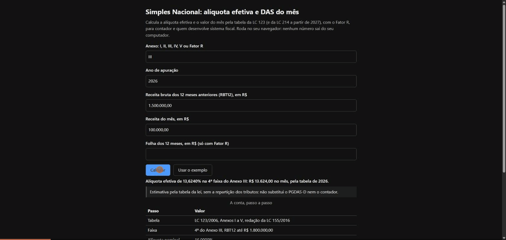

# simples-nacional-br

[](https://github.com/peterwkdev-creator/simples-nacional-br/actions/workflows/testes.yml)

Alíquota efetiva, valor do mês e Fator R do **Simples Nacional**, conferidos
faixa a faixa contra as tabelas oficiais da Lei Complementar 123/2006
(redação da LC 155/2016) e, de 2027 em diante, da LC 214/2025. Python puro,
só a biblioteca padrão, `Decimal` do começo ao fim.



**[Experimente no navegador](https://peterwkdev-creator.github.io/simples-nacional-br/)**:
a página roda esta mesma biblioteca, testada, no seu navegador (Pyodide):
alíquota efetiva, valor do mês, a parte de cada tributo e, com o Fator R,
a folha que leva ao Anexo III e quanto muda o DAS. Nenhum número sai do
seu computador. Na primeira visita o navegador baixa
cerca de 6 MB (o Python do Pyodide; a biblioteca são 61 KB); depois, cada
conta leva de 0 a 2 ms (medido na página publicada em 10/10/2026).

> **É estimativa, não consultoria tributária.** Não substitui o PGDAS-D nem o
> contador. Todos os exemplos usam números inventados.

## Instalar

```bash
pip install "git+https://github.com/peterwkdev-creator/simples-nacional-br@v1.4.2"
```

Sem dependência; Python 3.9 ou mais novo. Para só experimentar, nem precisa
instalar: do checkout limpo, os dois comandos abaixo rodam como estão.

```bash
python -m unittest
```

```bash
python -m simples_nacional --ano 2026 --anexo I --rbt12 4500000 --receita-mes 375000
```

Testado a cada push com Python 3.9 a 3.14 (Linux) e 3.13 (Windows).
Sem `--ano`, a linha de comando usa o ano corrente e diz qual tabela usou.

## Uso

```python
from simples_nacional import aliquota_efetiva, anexo_por_fator_r, avisos, valor_devido

aliquota_efetiva("I", 4_500_000, ano=2026)       # Decimal('0.106')
valor_devido("I", 4_500_000, "375000", ano=2026) # Decimal('39750.00')
anexo_por_fator_r(280_000, 1_000_000)            # 'III'
avisos(4_500_000, ano=2026)                      # ['RBT12 acima do sublimite ...']
```

`ano` é o ano-calendário do **mês de apuração**, não o de hoje: o DAS de
dezembro de 2026, calculado em janeiro de 2027, usa a tabela de 2026.
Valores em `Decimal`, `int` ou `str`; `float` é recusado, porque erra
centavo. RBT12 acima de R$ 4,8 milhões levanta `LimiteExcedido` (um
`ValueError`). Sublimite, início de atividade e a leitura de números no
formato brasileiro estão em [Mais exemplos](#mais-exemplos).

## Por quê

A alíquota efetiva não é a alíquota impressa no anexo. LC 123, art. 18,
§ 1º-A:

```
alíquota efetiva = (RBT12 × alíquota nominal − parcela a deduzir) / RBT12
```

RBT12 é a receita bruta dos 12 meses anteriores ao período de apuração (a
partir de 2027, dos 12 meses antecedentes ao mês anterior: para apurar março,
de fevereiro do ano anterior a janeiro; LC 123, art. 18, § 1º, na redação da
LC 214/2025). Um
comércio com RBT12 de R$ 4.500.000,00 está na 6ª faixa do Anexo I (nominal
19%, parcela a deduzir R$ 378.000,00):

```
(4.500.000 × 19% − 378.000) / 4.500.000 = 477.000 / 4.500.000 = 10,60%
```

Aplicar a nominal de 19% dá R$ 855.000,00 no ano, onde a lei dá
R$ 477.000,00. É o erro relatado em
[mcp-fiscal-brasil#146](https://github.com/DeHor-Labs/mcp-fiscal-brasil/issues/146).

## O que cobre

- Anexos I a V, seis faixas cada (teto, alíquota nominal, parcela a
  deduzir), com a alíquota efetiva e o valor do mês.
- Fator R: folha de 12 meses ÷ RBT12; 28% ou mais vai para o Anexo III,
  senão para o V. E o planejamento: a folha que leva a 28%, quanto falta e
  o valor do mês nos dois anexos.
- Teto de R$ 4,8 milhões: erro explicado, nunca número.
- Sublimite de R$ 3,6 milhões: aviso de que o valor é só a parte federal;
  a pedido, o ICMS ou ISS (e o IBS, desde 2027) pela 5ª faixa; até 2026, o
  mês em que a receita do ano passa do sublimite.
- Início de atividade, mês a mês, e o limite proporcional no ano de início.
- Tabela do ano de apuração: em 2027 e 2028 a 6ª faixa tem nominal 0,1
  ponto menor; a partir de 2029 volta a de hoje.
- Repartição do valor do mês por tributo (IRPJ, CSLL, Cofins, PIS, CPP,
  ICMS, ISS e, de 2027 em diante, CBS e IBS), com a tabela de cada período
  de 2018 a 2033.
- CNAE → anexo: a subclasse que impede o Simples, a ambígua (Res. CGSN
  140, Anexos VI e VII) e, para as outras, o anexo pela LC 123, art. 18,
  com o Fator R quando ele decide; a indústria vai ao Anexo I de 2027 em
  diante.
- Servidor MCP, para o Claude e outros assistentes chamarem as mesmas
  contas: valor do mês, repartição, Fator R e CNAE.

Fora do escopo, entre outros: sublimites estaduais, exportação e MEI. A
lista completa e a fonte legal de cada regra estão em [Fontes e limites](#fontes-e-limites).

## Como é testado

- Um caso por faixa de cada anexo (30), com a conta à mão escrita no teste e
  refeita a partir dos números da própria linha.
- O teto de cada faixa fica na faixa de baixo (o anexo diz "até"); um
  centavo acima sobe de faixa.
- Fator R em 27,99%, 28% e 28,01%.
- A 6ª faixa de 2027 e 2028 nos cinco anexos, com a conta à mão; as faixas 1
  a 5 iguais às de hoje; 2018, 2026, 2029 e depois com a tabela de hoje.
- Início de atividade: 1º, 2º, 4º e 12º mês até 2026; 1º, 2º, 3º, 5º e 13º
  a partir de 2027, com o mês anterior ao de apuração fora da média.
- ICMS, ISS e IBS pela 5ª faixa em 2027, 2028, 2029, 2030, 2031, 2032, 2033
  e depois, com a conta à mão; o mês que passa do sublimite com o RBT12 na
  1ª, 4ª, 5ª e 6ª faixa, com e sem o teto de 5% do ISS, com e sem
  impedimento, e nas fronteiras de 20% do sublimite e do limite.
- Teste de mutação: trocar qualquer um dos 90 valores da tabela, uma das
  cinco nominais de 2027, um dos 85 percentuais de repartição, uma fronteira
  de ano ou uma regra do início de atividade, um de cada vez, derruba pelo
  menos um teste.
- Os exemplos em Python deste README rodam como estão, num teste.

Arredondamento: a lei não fixa regra. A alíquota efetiva guarda todos os
dígitos; o valor do mês é arredondado em centavos com `ROUND_HALF_UP`. As
contas usam um contexto `Decimal` próprio (28 dígitos): um
`getcontext().prec` mudado no programa de quem usa a biblioteca não muda o
resultado. Na linha de comando, a efetiva da linha "Valor do mês" sai com
as casas (4 ou mais) que fecham a conta no centavo, e o Fator R é cortado,
não arredondado, na 4ª casa: 27,99999% aparece 27,9999%, ao lado do Anexo V.

## Mais exemplos

```python
from simples_nacional import (aliquota_efetiva, valor_devido, valor_devido_acima_do_sublimite,
                              valor_devido_inicio_atividade)

aliquota_efetiva("I", 4_500_000, ano=2027)      # Decimal('0.105'): 6ª faixa de 2027

# acima do sublimite com a receita do ano dentro dele, até 2026:
# 6ª faixa só federal (10,6%) + ICMS pela 5ª faixa (12,36% × 33,5% = 4,1406%)
aliquota_efetiva("I", 4_500_000, ano=2026, icms_iss_no_das=True)       # Decimal('0.14740600')
valor_devido("I", 4_500_000, "375000", ano=2026, icms_iss_no_das=True) # Decimal('55277.25')

# de 2027 em diante, também o IBS: 10,5% + 12,36% × (33,50% + 0,17%)
aliquota_efetiva("I", 4_500_000, ano=2027, icms_iss_no_das=True)       # Decimal('0.14661612')

# até 2026, o mês em que a receita do ano (3.400.000 antes dele) passa do sublimite:
# 200.000 dentro, pela efetiva com ISS, e 300.000 acima, federais + ISS em 3.600.000
valor_devido_acima_do_sublimite("III", 4_000_000, 500_000, 3_400_000, ano=2026)  # Decimal('113563.08')

# início de atividade: receita de cada mês, do 1º até o de apuração
valor_devido_inicio_atividade("I", [30_000, 50_000], ano=2026)  # Decimal('2825.00')
valor_devido_inicio_atividade("I", [400_000], ano=2027)         # Decimal('16000.00'), 1ª faixa
```

Na linha de comando, o ICMS ou o ISS pela 5ª faixa vem com
`--icms-iss-no-das`, e a saída mostra as duas parcelas da efetiva:

```bash
python -m simples_nacional --ano 2026 --anexo I --rbt12 4500000 --receita-mes 375000 --icms-iss-no-das
```

Até 2026, `--receita-ano` (a receita do ano antes do mês de apuração) calcula
o mês em que ela passa do sublimite e mostra cada parcela:

```bash
python -m simples_nacional --ano 2026 --anexo III --rbt12 4000000 --receita-mes 500000 --receita-ano 3400000
```

Na linha de comando, o início de atividade vai em `--receitas`, separadas
por ponto e vírgula, no lugar de `--rbt12` e `--receita-mes`:

```bash
python -m simples_nacional --ano 2026 --anexo I --receitas "30.000;50.000"
```

Com `--mes-inicio` (o mês do calendário em que a atividade começou, de 1 a
12), a saída confere a receita do ano de início contra o limite e o
sublimite proporcionais; sem ele, avisa quando a receita passa de
R$ 300.000,00 por mês e pede o mês. Na API, o mesmo vem de
`avisos_inicio_atividade(receitas, mes_inicio, ano=...)`:

```python
from simples_nacional import avisos_inicio_atividade

# aberta em novembro: 2 meses até dezembro, limite 800.000 e sublimite 600.000
avisos_inicio_atividade([300_000, 400_000], 11, ano=2026)
# ['Receita acumulada no ano de início de atividade (2026) de R$ 700.000,00,
#   acima do sublimite proporcional de R$ 600.000,00 ...']
```

Na linha de comando e em `ler_numero`, números aceitos: `4500000`,
`4500000.00`, `1000,50`, `1.000,50` e
`360.000` (ponto seguido de três dígitos é milhar), com ou sem `R$` na
frente e espaço nas pontas, como o Excel copia a célula (`R$ 1.000,50`). O
que é ambíguo, como `1,000.50` ou `100 000`, dá erro em vez de virar outro
número. `--version` mostra a versão instalada.

A mesma leitura e a saída no formato brasileiro são públicas, para quem
integra a biblioteca num sistema:

```python
from decimal import Decimal
from simples_nacional import ler_numero, para_decimal, porcentagem, reais

ler_numero("360.000")                 # Decimal('360000'); ambíguo: ValueError
para_decimal("1000.50", "receita")    # Decimal('1000.50'); float: TypeError
para_decimal("360.000", "receita")    # Decimal('360.000'): ponto decimal, como no Decimal
porcentagem(Decimal("0.0565"))        # '5,6500%'
reais(Decimal("4800000"))             # '4.800.000,00'
```

Na API, o texto vai com ponto decimal, como no `Decimal`: `"360.000"` é
360. Para o formato brasileiro, passe antes por `ler_numero`.

### Planejamento do Fator R

```python
from simples_nacional import planejar_fator_r

p = planejar_fator_r(120_000, 600_000, 50_000, ano=2026)  # folha12, rbt12, receita_mes
p.fator            # Decimal('0.2'): 20%, Anexo V
p.folha_minima     # Decimal('168000.00') = 28% × 600.000
p.folha_que_falta  # Decimal('48000.00')
p.das_anexo_v      # Decimal('8925.00') = 50.000 × 17,85%
p.das_anexo_iii    # Decimal('5280.00') = 50.000 × 10,56%
p.diferenca_das    # Decimal('3645.00'): o III sai mais barato no mês
```

- A folha mínima é 28% do RBT12 arredondada para cima no centavo, para dar
  28% ou mais (LC 123, art. 18, §§ 5º-J e 5º-M); a folha é a do § 24, com
  o pró-labore e os encargos.
- **A diferença é só no DAS.** O pró-labore a mais paga a contribuição
  previdenciária do sócio e pode pagar IRPF, que dependem da pessoa: nada
  disso está descontado.
- O Fator R olha os 12 meses da folha: o que falta pode entrar aos poucos
  ou de uma vez, e a biblioteca não escolhe.
- Na 6ª faixa o Anexo V pode sair mais barato que o III (diferença
  negativa).
- Na linha de comando, `--anexo fator-r --folha12 ...` mostra o mesmo
  planejamento, exceto no mês do art. 24 (`--receita-ano`).

### Repartição do DAS por tributo

```python
from simples_nacional import aliquotas_por_tributo, parcelas_das

parcelas_das("III", 3_000_000, 100_000, ano=2026)
# {'IRPJ': 711.08, 'CSLL': 621.31, 'COFINS': 2277.36, 'PIS': 493.74,
#  'CPP': 7708.51, 'ISS': 5000.00}  (Decimal, em reais; soma 16.812,00)

parcelas_das("I", 1_000_000, 80_000, ano=2027)
# {'IRPJ': 371.80, 'CSLL': 236.60, 'CBS': 1036.31, 'CPP': 2839.20,
#  'ICMS': 2264.60, 'IBS': 11.49}  (soma 6.760,00: efetiva 8,45%)

aliquotas_por_tributo("I", 1_000_000, ano=2027)["IRPJ"]  # 8,45% × 5,50% = 0,46475%
```

- `parcelas_das` dá quanto do DAS do mês vai a cada tributo, em centavos;
  a soma é o `valor_devido`. Cada parcela começa truncada no centavo, e o
  que falta vai às de maior fração descartada (convenção da biblioteca: a
  lei não fixa o arredondamento). `aliquotas_por_tributo` dá a fração da
  receita de cada um, sem arredondar; somam a alíquota efetiva.
- 2018 a 2026: LC 123, Anexos I a V, redação da LC 155/2016. 2027 e 2028,
  2029, 2030, 2031, 2032 e de 2033 em diante: uma tabela por período da
  LC 214/2025 (Anexos XVIII a XXII), com CBS e IBS; o IBS toma o lugar do
  ICMS e do ISS aos poucos, e de 2033 em diante só há IBS.
- 5ª faixa dos Anexos III e IV: o ISS fica no teto da nota (*) do anexo (5%
  até 2028; 4,5%, 4%, 3,5% e 3% de 2029 a 2032), e a diferença vai aos
  outros pelos percentuais da nota. Três dessas notas da LC 214 somam
  100,01% ou 99,99% (IV em 2029 e 2031, III em 2030): os percentuais se
  aplicam na proporção deles, para a soma bater com o DAS.
- 6ª faixa (acima do sublimite): só os federais e a CBS; ICMS, ISS e IBS se
  pagam fora do DAS. O mês em que a receita do ano passa do sublimite e o
  ICMS ou ISS pela 5ª faixa (`icms_iss_no_das`) não se repartem aqui.
- É estimativa: não substitui o PGDAS-D nem o contador.

### CNAE → anexo

```python
from simples_nacional.cnae import enquadrar

enquadrar("6920-6/01", ano=2026).anexo   # 'III': contabilidade, § 5º-B, XIV
enquadrar("1091-1/02", ano=2026).anexo   # 'II': indústria até 2026
enquadrar("1091-1/02", ano=2027).anexo   # 'I': indústria de 2027 em diante
enquadrar("8299-7/04", ano=2026).situacao  # 'impeditiva': leiloeiro, Anexo VI

e = enquadrar("7112-0/00", ano=2026, folha12=300_000, rbt12=1_000_000)
e.situacao, e.fator_r, e.anexo           # ('fator_r', Decimal('0.3'), 'III')
```

```bash
python -m simples_nacional.cnae 6920-6/01 1091102 --ano 2027
```

- A situação é uma de cinco: `impeditiva` (Anexo VI da Res. CGSN 140: com
  ela no CNPJ, não há opção pelo Simples), `ambígua` (Anexo VII: parte da
  subclasse impede, parte não), `anexo`, `fator_r` (Anexo III ou V; com
  `folha12` e `rbt12`, o anexo vem resolvido) e `sem_classificacao`.
- **Não há tabela oficial CNAE → anexo.** As listas dos Anexos VI e VII são
  oficiais; a ligação de cada subclasse a um anexo é a leitura desta
  biblioteca da LC 123, art. 18, com o parágrafo no `fundamento`. Onde a lei
  não descreve a atividade sem margem de dúvida, a resposta é
  `sem_classificacao`, nunca um palpite.
- De 2027 em diante, a indústria vai ao Anexo I e o II fica só para produto
  com IPI mantido, o da Zona Franca de Manaus (LC 123, art. 18, §§ 4º, II, e
  5º, redação da LC 214/2025): a observação avisa.
- O nome de cada uma das 1.332 subclasses vem da lista do IBGE (CNAE 2.3);
  código inexistente dá `ValueError`.

### Servidor MCP

As mesmas contas como servidor [MCP](https://modelcontextprotocol.io)
(Model Context Protocol), para o Claude e outros assistentes chamarem. Roda
no seu computador, pela entrada e saída padrão, só com a biblioteca padrão;
nenhum número sai dali. Depois do `pip install` acima:

```bash
python -m simples_nacional.mcp
```

No Claude Code:

```bash
claude mcp add --transport stdio simples-nacional -- python -m simples_nacional.mcp
```

No Claude Desktop, em `claude_desktop_config.json`:

```json
{
  "mcpServers": {
    "simples-nacional": {
      "command": "python",
      "args": ["-m", "simples_nacional.mcp"]
    }
  }
}
```

`python` tem de ser o Python em que a biblioteca foi instalada; se o
aplicativo não o acha, ponha o caminho completo, que
`python -c "import sys; print(sys.executable)"` mostra.

Sem `pip`: cada Release traz o pacote
`simples-nacional-br-<versão>.mcpb`, que o Claude Desktop instala como
extensão (abra o arquivo nele). Precisa de Python 3.9 ou mais novo no
computador. O mesmo pacote está no
[catálogo oficial de servidores MCP](https://registry.modelcontextprotocol.io)
como `io.github.peterwkdev-creator/simples-nacional-br`.

Quatro ferramentas, todas só cálculo (não leem nem gravam nada fora delas):

| Ferramenta | Argumentos | Devolve |
|---|---|---|
| `calcular_das` | `anexo`, `rbt12`, `receita_mes`, `ano`; `icms_iss_no_das` | faixa, alíquota efetiva, valor do mês e avisos |
| `repartir_das` | `anexo`, `rbt12`, `receita_mes`, `ano` | o valor do mês por tributo e a alíquota de cada um |
| `planejar_fator_r` | `folha12`, `rbt12`, `receita_mes`, `ano`; `icms_iss_no_das` | o Fator R, a folha que leva a 28% e o valor do mês nos Anexos V e III |
| `enquadrar_cnae` | `cnae`, `ano`; `folha12`, `rbt12` | a situação da subclasse, o anexo e o fundamento |

- `ano` é obrigatório em todas, pelo mesmo motivo da API: é o ano do mês de
  apuração, não o de hoje. Os depois do ponto e vírgula são opcionais.
- Valores em reais, como número JSON ou texto no formato brasileiro
  (`"4.500.000,00"`); a conta é em `Decimal`, sem passar por `float`.
- A resposta vem em texto, para o assistente ler, e em JSON
  (`structuredContent`), com os valores em texto (`"39750.00"`) e o aviso
  de que é estimativa. Entrada errada ou RBT12 acima do limite volta como
  erro da ferramenta, com a mensagem da biblioteca.
- Protocolo: atende a forma com `initialize` (revisões 2025-06-18 e
  2025-11-25) e a sem estado, com `server/discover` (2026-07-28), no mesmo
  processo.

## Fontes e limites

| | Fonte (LC 123/2006, redação da LC 155/2016) |
|---|---|
| Anexos I a V, seis faixas cada: teto, alíquota nominal, parcela a deduzir | Anexos I a V |
| Alíquota efetiva | art. 18, § 1º-A |
| Valor do mês: receita do mês × alíquota efetiva | art. 18, § 3º |
| Fator R: folha de 12 meses ÷ RBT12; 28% ou mais → Anexo III, senão V. Planejamento (`planejar_fator_r`): folha de 28% do RBT12, para cima no centavo, e o valor do mês nos dois anexos | art. 18, §§ 5º-J, 5º-K, 5º-M e 24 |
| Teto de R$ 4,8 milhões: erro explicado, nunca número | art. 3º, II |
| Sublimite de R$ 3,6 milhões: aviso de que o valor é só a parte federal e de que ICMS e ISS (e o IBS, desde 2027) saem do DAS ou seguem nele conforme a receita acumulada no ano | art. 13-A; Res. CGSN 140/2018, arts. 21, III, b, e 24; LC 214/2025, arts. 517 e 518 |
| RBT12 acima de R$ 3,6 milhões e receita do ano dentro do sublimite, a pedido (`icms_iss_no_das=True`): efetiva da 5ª faixa × repartição dela, somada à 6ª faixa, que é só federal. Até 2026, ICMS ou ISS (I 33,50%, II 32,00%, III 33,50%, IV 40,00%, V 23,50%); de 2027 a 2032, ICMS ou ISS e IBS, pela tabela de cada período; de 2033 em diante, só o IBS | Res. CGSN 140/2018, art. 21, III, b, e IV (redação da Res. CGSN 190/2026); repartição dos Anexos I a V da LC 123 e XVIII a XXII da LC 214 |
| Até 2026, o mês em que a receita do ano passa do sublimite (`valor_devido_acima_do_sublimite`): a parcela dentro dele pela efetiva com ICMS ou ISS; a de cima, federais pela faixa do RBT12 mais ICMS ou ISS pela 5ª faixa em R$ 3,6 milhões; a que passa de R$ 4,8 milhões, federais da 6ª faixa em R$ 4,8 milhões mais o mesmo ICMS ou ISS. Avisa quando o impedimento e a exclusão valem (mês seguinte, se o excesso passa de 20%; senão, ano seguinte) | Res. CGSN 140/2018, arts. 12 e 24; LC 123, art. 3º, §§ 9º e 9º-A, e art. 20, §§ 1º e 1º-A |
| Início de atividade, mês a mês: até 2026, 1º mês com a receita do próprio mês × 12 e do 2º ao 12º com a média dos anteriores × 12; a partir de 2027, 1º e 2º mês na 1ª faixa e do 3º ao 13º com a média dos meses antes do mês anterior × 12 | art. 18, § 2º; Res. CGSN 140/2018, art. 22, e Res. CGSN 190/2026 |
| Ano de início de atividade: limite de R$ 400.000,00 e sublimite de R$ 300.000,00 vezes os meses do início a dezembro (fração conta como mês), com aviso de exclusão desde o início, se o excesso passa de 20%, ou a partir do ano seguinte | art. 3º, §§ 2º e 10 a 13; art. 31, III; Res. CGSN 140/2018, arts. 3º e 9º, § 2º |
| Tabela do ano de apuração: em 2027 e 2028 a 6ª faixa tem nominal 0,1 ponto menor; a partir de 2029 volta a de hoje | LC 214/2025, art. 519 e Anexos XVIII a XXII |
| Repartição por tributo (`parcelas_das`, `aliquotas_por_tributo`): efetiva × percentual da faixa; na 5ª faixa de III e IV, ISS no teto da nota (*) do anexo | LC 123, Anexos I a V (redação da LC 155/2016); LC 214/2025, Anexos XVIII a XXII |
| CNAE → anexo (`simples_nacional.cnae`): subclasse impeditiva e ambígua; para as outras, o anexo pela atividade, com o Fator R onde ele decide; indústria no Anexo II até 2026 e no I de 2027 em diante | Res. CGSN 140/2018, art. 8º e Anexos VI (redação da Res. CGSN 143/2018) e VII (redação da Res. CGSN 156/2020); LC 123, art. 18, §§ 4º e 5º a 5º-M; LC 214/2025, art. 517 |

Cada valor de tabela foi lido no site da Câmara dos Deputados em 09/10/2026
([LC 155/2016, texto atualizado](https://www2.camara.leg.br/legin/fed/leicom/2016/leicomplementar-155-27-outubro-2016-783850-normaatualizada-pl.html));
a fonte fica ao lado da tabela em `simples_nacional/tabelas.py`. A tabela de
2027 e 2028 foi lida no mesmo dia no
[texto atualizado da LC 214/2025](https://www2.camara.leg.br/legin/fed/leicom/2025/leicomplementar-214-16-janeiro-2025-796905-normaatualizada-pl.html);
a repartição da 5ª faixa de 2027 em diante, no
[texto compilado do Planalto](https://www.planalto.gov.br/ccivil_03/leis/lcp/lcp214.htm),
salvo em 09/10/2026 e conferido em 10/10/2026. A repartição por tributo foi
lida nas mesmas páginas da Câmara (2018 a 2026 e de 2029 em diante em
10/10/2026; 2027 e 2028 em 09/10/2026); a fonte de cada tabela fica em
`simples_nacional/tabelas_reparticao.py`.

As regras do início de atividade foram lidas em 09/10/2026 no portal de
normas da Receita:
[Res. CGSN 140/2018](https://normasinternet2.receita.fazenda.gov.br/#/consulta/externa/92278)
e [Res. CGSN 190/2026](https://normasinternet2.receita.fazenda.gov.br/#/consulta/externa/152832).
Média zero no início de atividade (nenhuma venda ainda) dá a alíquota da
1ª faixa: a fórmula não se define com RBT12 zero, e essa é uma convenção da
biblioteca.

No mês em que a receita do ano passa do sublimite, nos Anexos III e IV, a
parte federal da faixa do RBT12 é a efetiva menos o ISS limitado a 5%: a
diferença acima de 5% fica com os federais (Res. CGSN 140, art. 21, III, a).
É a leitura da biblioteca; o ISS pela 5ª faixa em R$ 3,6 milhões entra
inteiro, porque o teto ali só muda a repartição, não o total.

A partir de 2027, o valor do mês é o DAS cheio, já com as parcelas de CBS e
IBS. Quem optar por pagar esses dois tributos pelo regime regular (LC 123,
art. 13, § 9º) os recolhe fora, e o DAS fica menor: esse cálculo não está
aqui.

Fora do escopo: sublimites estaduais, o ano em que o sublimite é ultrapassado depois do de
início de atividade (art. 3º, §§ 11 a 15), as receitas de exportação, que
têm limite próprio (art. 3º, § 14), o mês em que a receita do ano passa do
sublimite a partir de 2027 (Res. CGSN 140, art. 24, com o IBS: dá erro) e,
nele, o ano de início de atividade (§ 1º) e a exportação em separado (§ 8º),
a empresa aberta no ano anterior ao da opção (Res. CGSN 140, art. 22, § 4º)
e o MEI.

## O que há em cada pasta

- `simples_nacional/`: a biblioteca. `tabelas.py` e
  `tabelas_reparticao.py` têm os valores da lei, cada um com a fonte;
  `calculo.py`, as contas; `reparticao.py`, a repartição por tributo;
  `planejamento.py`, o planejamento do Fator R; `cnae.py`, o enquadramento
  CNAE → anexo, com os dados em `cnae_dados.py` e os nomes do IBGE em
  `cnae_subclasses.tsv`; `formato.py`, a leitura e a escrita de números no
  formato brasileiro; `__main__.py`, a linha de comando; `mcp.py`, o
  servidor MCP.
- `tests/`: os testes, inclusive o que roda os exemplos deste README.
- `vitrine/`: a página do "Experimente no navegador". O GitHub Actions a
  monta e publica a cada push que muda a biblioteca, a página ou os testes
  (`.github/workflows/pages.yml`).
- `mcpb/`: o pacote MCPB do servidor MCP e o `server.json` do catálogo. O
  GitHub Actions os monta, anexa o pacote à Release e publica no catálogo a
  cada versão (`.github/workflows/catalogo-mcp.yml`).
- `docs/`: o GIF do começo deste README.
- [`CHANGELOG.md`](CHANGELOG.md): o que mudou em cada versão.

## Compatibilidade

Desde a 1.0.0, a numeração segue o [Versionamento Semântico](https://semver.org/lang/pt-BR/).
O que está em `simples_nacional.__all__` e em `simples_nacional.cnae.__all__`
só muda de forma incompatível numa versão maior (2.0). Função, constante ou
argumento novo sai numa versão menor (1.1); correção, numa de correção
(1.0.1). Valor de tabela que muda por lei ou resolução nova sai numa versão
menor, com a fonte e a data no [CHANGELOG.md](CHANGELOG.md); o mesmo vale
para o anexo de uma subclasse da CNAE, que é leitura da biblioteca. No servidor MCP, o nome
de cada ferramenta, seus argumentos e as chaves do `structuredContent`
seguem a mesma regra. Nomes com `_` na frente e o texto dos avisos e das
respostas não fazem parte da promessa.

## Versão para escritórios

A biblioteca é e continua grátis, sob a licença MIT. Para escritórios de
contabilidade, está em preparo uma versão completa, que faz a mais: o
regime híbrido de 2027 em diante (IBS e CBS fora do DAS), a comparação do
Simples com o Lucro Presumido e o Real e a carteira de clientes. Ainda sem
preço nem data. Para entrar na lista de espera, reaja com 👍 na
[issue #1](https://github.com/peterwkdev-creator/simples-nacional-br/issues/1).

## Contribuir

Achou um valor diferente do PGDAS-D ou da sua conta, ou um caso de borda
que falta? [Abra uma issue](https://github.com/peterwkdev-creator/simples-nacional-br/issues/new/choose)
pelo modelo "Valor diferente do esperado", com números inventados. Para
mandar código, veja o [CONTRIBUTING.md](CONTRIBUTING.md); a conversa segue
o [código de conduta](CODE_OF_CONDUCT.md).

## Licença

[MIT](LICENSE).
